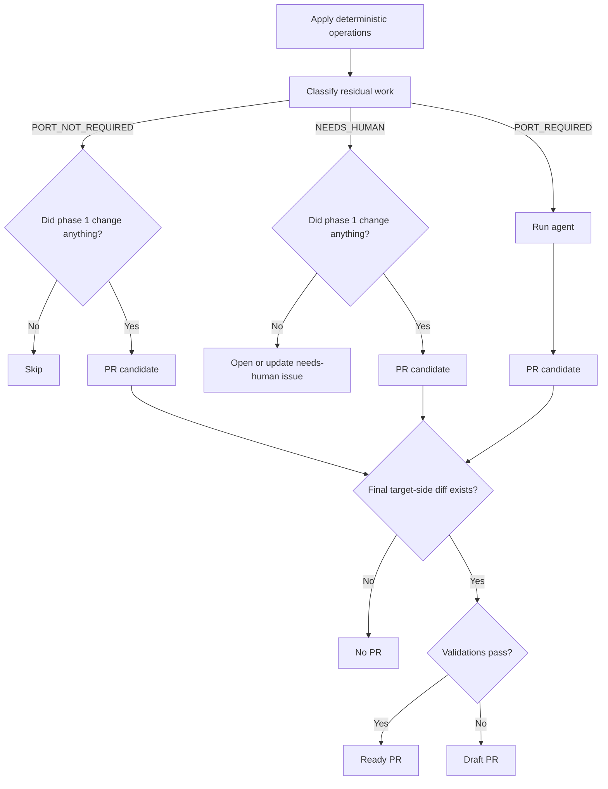
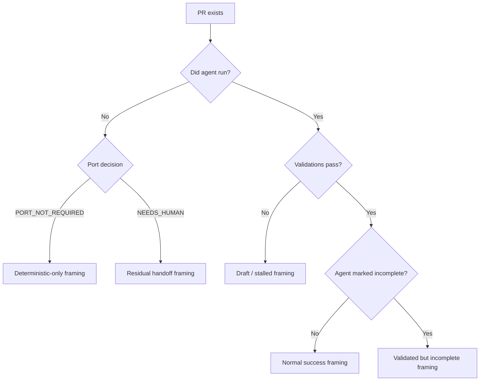

# State Machine

How `repo-port-bot` maps a source change into a user-visible artifact.

This document is intentionally narrow. It is the canonical expression of run states and artifact selection. It does **not** describe future product ideas, open questions, prompt design, or reviewer-facing PR copy in detail.

## Purpose

The system may apply:

1. deterministic operations, and then
2. agent-authored residual work

This doc defines:

- what facts determine the final state
- which states are reachable
- what artifact is produced for each reachable state

## Derived facts

These are the only facts the state machine cares about:

- `phase1_changed`
    - `yes` when deterministic operations produced a target-side diff
    - `no` when they produced no target-side diff
- `port_decision`
    - `PORT_NOT_REQUIRED`
    - `NEEDS_HUMAN`
    - `PORT_REQUIRED`
- `agent_ran`
    - `yes` when the agent actually started execution
    - `no` when the run never entered agent execution
- `validation`
    - `pass` when the final working tree passed configured validations
    - `fail` when the final working tree failed configured validations
- `target_side_diff`
    - `yes` when there is a diff to deliver at the end of the run
    - `no` when there is nothing to commit or open a PR for

## Code mapping

The spec-style names in this document map to code as follows:

- `phase1_changed` → `DeterministicPhaseResult.changed` / `context.deterministic.changed`
- `port_decision` → `PortDecision.kind` / `portDecision.outcome.kind`
- `agent_ran` → whether `ExecutePortResult` exists
- `validation` → `ValidationCommandResult[]` pass/fail
- `target_side_diff` → `checkTargetSideDiff()` result

## Pre-deterministic skip

Some heuristics suppress the entire run **before** deterministic operations touch the target checkout:

- missing source pull request → `PORT_NOT_REQUIRED` (no PR metadata to work with)
- `auto-port` label → `PORT_NOT_REQUIRED` (loop prevention)
- `no-port` label → `PORT_NOT_REQUIRED` (explicit opt-out)

These signals take priority over deterministic operations. If any of them match, the run exits immediately with no target-side mutation. All other heuristics (docs-only, config-only, no remaining files) run after deterministic operations, during residual classification.

## Interpretation rules

- Deterministic operations always run first (unless a pre-deterministic skip applies).
- Residual classification only evaluates the work that remains after deterministic operations.
- The classifier does **not** decide whether any PR exists at all. It only decides what should happen to the residual work.
- If deterministic operations produce necessary target-side changes, a PR may still be opened even when the residual work is `PORT_NOT_REQUIRED` or `NEEDS_HUMAN`.
- If `target_side_diff = no` at delivery time, do not create a branch or PR.
- When a PR exists, validation determines whether it is `ready` or `draft`.
- This version of the state machine does **not** split successful agent runs into separate artifact states based on `agent_complete`; that is a reviewer-framing concern, not an artifact-selection concern here.

## Canonical state table

Only reachable states are listed below.

| `phase1_changed` | `port_decision`     | `agent_ran` | `validation` | `target_side_diff` | Artifact | PR state | Meaning                                                                        |
| ---------------- | ------------------- | ----------- | ------------ | ------------------ | -------- | -------- | ------------------------------------------------------------------------------ |
| no               | `PORT_NOT_REQUIRED` | no          | n/a          | no                 | none     | n/a      | Skip                                                                           |
| yes              | `PORT_NOT_REQUIRED` | no          | pass         | yes                | PR       | ready    | Deterministic-only PR                                                          |
| yes              | `PORT_NOT_REQUIRED` | no          | fail         | yes                | PR       | draft    | Deterministic-only PR with validation failure                                  |
| no               | `NEEDS_HUMAN`       | no          | n/a          | no                 | issue    | n/a      | No target-side changes exist, so hand off with a `needs-human` issue           |
| yes              | `NEEDS_HUMAN`       | no          | pass         | yes                | PR       | ready    | Deterministic PR plus residual handoff note                                    |
| yes              | `NEEDS_HUMAN`       | no          | fail         | yes                | PR       | draft    | Deterministic PR plus residual handoff note, but validations failed            |
| no or yes        | `PORT_REQUIRED`     | yes         | pass         | yes                | PR       | ready    | Agent-authored residual work succeeded                                         |
| no or yes        | `PORT_REQUIRED`     | yes         | fail         | yes                | PR       | draft    | Agent-authored residual work did not validate; preserve progress in a draft PR |
| no or yes        | any                 | any         | any          | no                 | none     | n/a      | No branch push and no PR upsert because nothing remains to deliver             |

## Artifact meanings

- `none`
    - no target-side artifact is created
    - source-side notification may still be posted
- `issue`
    - open or update a `needs-human` issue
    - used only when no target-side changes exist to preserve in a PR
- `PR`
    - open or update one stable pull request
    - `ready` means validations passed
    - `draft` means validations failed and preserved progress still needs human follow-up

## Artifact selection flow

## PR framing flow

Artifact selection and PR framing are related but distinct.

- artifact selection determines whether the system produces `none`, `issue`, or `PR`, and whether the PR is `ready` or `draft`
- PR framing determines how an existing PR should explain itself to a reviewer

The final branch (`agent marked incomplete?`) is a reviewer-framing concern, not an artifact-selection concern in this document. It exists to make the open product question visible.

## Summary

The state machine is artifact-first:

- no target-side diff -> no PR
- target-side diff with no residual automation needed -> PR
- target-side diff with residual work requiring human judgment -> PR with a handoff note
- residual work requiring agent execution -> agent runs
- validation failure -> draft PR
- no target-side diff plus residual `NEEDS_HUMAN` -> issue
